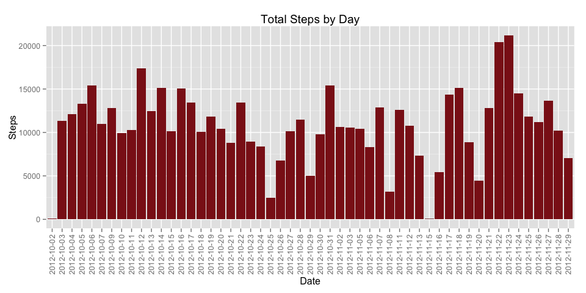

# Reproducible Research: Peer Assessment 1
Submitted by: Kevin Lessard

## Loading and preprocessing the data

Download the activity dataset - https://d396qusza40orc.cloudfront.net/repdata%2Fdata%2Factivity.zip

For this analysis we will be utiizing the ggplot2 and plyr packages.


```r
library(ggplot2)
library(plyr)

rawData <- read.table(unz("activity.zip","activity.csv"), header=TRUE, sep=",")
cleanData <- rawData[complete.cases(rawData),] 
```

## What is mean total number of steps taken per day?

Below is histogram of the total steps taken per day.


```r
#histogram for total stpes by day
qplot(date, data = cleanData, weight = steps) +
        geom_histogram(fill="firebrick4")  +
        scale_y_continuous("Steps") +
        labs(x = "Date") +      
        theme(axis.text.x = element_text(angle = 90, vjust = 0.5)) +
        labs(title = "Total Steps by Day")
```

 
Figure 1

Here is the mean and median values for each day.


```r
ddply(cleanData,~date,summarise,mean=mean(steps),median=median(steps))
```

```
##          date    mean median
## 1  2012-10-02  0.4375      0
## 2  2012-10-03 39.4167      0
## 3  2012-10-04 42.0694      0
## 4  2012-10-05 46.1597      0
## 5  2012-10-06 53.5417      0
## 6  2012-10-07 38.2465      0
## 7  2012-10-09 44.4826      0
## 8  2012-10-10 34.3750      0
## 9  2012-10-11 35.7778      0
## 10 2012-10-12 60.3542      0
## 11 2012-10-13 43.1458      0
## 12 2012-10-14 52.4236      0
## 13 2012-10-15 35.2049      0
## 14 2012-10-16 52.3750      0
## 15 2012-10-17 46.7083      0
## 16 2012-10-18 34.9167      0
## 17 2012-10-19 41.0729      0
## 18 2012-10-20 36.0938      0
## 19 2012-10-21 30.6285      0
## 20 2012-10-22 46.7361      0
## 21 2012-10-23 30.9653      0
## 22 2012-10-24 29.0104      0
## 23 2012-10-25  8.6528      0
## 24 2012-10-26 23.5347      0
## 25 2012-10-27 35.1354      0
## 26 2012-10-28 39.7847      0
## 27 2012-10-29 17.4236      0
## 28 2012-10-30 34.0938      0
## 29 2012-10-31 53.5208      0
## 30 2012-11-02 36.8056      0
## 31 2012-11-03 36.7049      0
## 32 2012-11-05 36.2465      0
## 33 2012-11-06 28.9375      0
## 34 2012-11-07 44.7326      0
## 35 2012-11-08 11.1771      0
## 36 2012-11-11 43.7778      0
## 37 2012-11-12 37.3785      0
## 38 2012-11-13 25.4722      0
## 39 2012-11-15  0.1424      0
## 40 2012-11-16 18.8924      0
## 41 2012-11-17 49.7882      0
## 42 2012-11-18 52.4653      0
## 43 2012-11-19 30.6979      0
## 44 2012-11-20 15.5278      0
## 45 2012-11-21 44.3993      0
## 46 2012-11-22 70.9271      0
## 47 2012-11-23 73.5903      0
## 48 2012-11-24 50.2708      0
## 49 2012-11-25 41.0903      0
## 50 2012-11-26 38.7569      0
## 51 2012-11-27 47.3819      0
## 52 2012-11-28 35.3576      0
## 53 2012-11-29 24.4688      0
```
Table 1


## What is the average daily activity pattern?

Below is a time series plot of averge steps taken at each interval over all days.
Note - the interval measurement is representative of 24hour time (e.g. 1600 represents 4:00pm)


```r
ggplot(cleanData, aes(interval,steps)) +
        stat_summary(fun.y = 'mean', colour = 'red', size=1, geom = 'line') +
        scale_x_continuous("Interval", limits = c(0, 2400), breaks = seq(0,2400,200))  +
        labs(y = "Steps") +
        theme(axis.text.x = element_text(angle = 90, vjust = 0.5))
```

 
Figure 2

The 5 minute interval that contains the maximum number of steps is


```r
##interval with maximum steps
sumData <- ddply(cleanData, c("interval"), summarize, sumSteps = sum(steps))
orderData <- sumData[order(-sumData$sumSteps),]
orderData[1,]
```

```
##     interval sumSteps
## 104      835    10927
```
Table 2


## Imputing missing values

Below is the number of records with NAs


```r
#count of all na rows
sum(!complete.cases(rawData))
```

```
## [1] 2304
```
Table 3

The strategy to fill in all missing values will be to replace the missing step value with the average steps taken at that interval over all days.

Creation of new dataset with missing data filled in using the above strategy


```r
impute.mean <- function(x) replace(x, is.na(x), mean(x, na.rm = TRUE))
imputeData <- ddply(rawData, ~ interval, transform, steps = impute.mean(steps))
imputeData <- imputeData[order(imputeData$interval), ]
```

Below is a re-plot of the historgram from figure 1 with the newly created dataset with missing data filled in.


```r
print(qplot(date, data = imputeData, weight = steps) +
              geom_histogram(fill="firebrick4")  +
              scale_y_continuous("Steps") +
              labs(x = "Date") +      
              theme(axis.text.x = element_text(angle = 90, vjust = 0.5)) +
              labs(title = "Total Steps by Day"))
```

 
Figure 3

Here is the calculation of mean and median values against the new created dataset with missing data filled in.


```r
ddply(imputeData,~date,summarise,mean=mean(steps),median=median(steps))
```

```
##          date    mean median
## 1  2012-10-01 37.3826  34.11
## 2  2012-10-02  0.4375   0.00
## 3  2012-10-03 39.4167   0.00
## 4  2012-10-04 42.0694   0.00
## 5  2012-10-05 46.1597   0.00
## 6  2012-10-06 53.5417   0.00
## 7  2012-10-07 38.2465   0.00
## 8  2012-10-08 37.3826  34.11
## 9  2012-10-09 44.4826   0.00
## 10 2012-10-10 34.3750   0.00
## 11 2012-10-11 35.7778   0.00
## 12 2012-10-12 60.3542   0.00
## 13 2012-10-13 43.1458   0.00
## 14 2012-10-14 52.4236   0.00
## 15 2012-10-15 35.2049   0.00
## 16 2012-10-16 52.3750   0.00
## 17 2012-10-17 46.7083   0.00
## 18 2012-10-18 34.9167   0.00
## 19 2012-10-19 41.0729   0.00
## 20 2012-10-20 36.0938   0.00
## 21 2012-10-21 30.6285   0.00
## 22 2012-10-22 46.7361   0.00
## 23 2012-10-23 30.9653   0.00
## 24 2012-10-24 29.0104   0.00
## 25 2012-10-25  8.6528   0.00
## 26 2012-10-26 23.5347   0.00
## 27 2012-10-27 35.1354   0.00
## 28 2012-10-28 39.7847   0.00
## 29 2012-10-29 17.4236   0.00
## 30 2012-10-30 34.0938   0.00
## 31 2012-10-31 53.5208   0.00
## 32 2012-11-01 37.3826  34.11
## 33 2012-11-02 36.8056   0.00
## 34 2012-11-03 36.7049   0.00
## 35 2012-11-04 37.3826  34.11
## 36 2012-11-05 36.2465   0.00
## 37 2012-11-06 28.9375   0.00
## 38 2012-11-07 44.7326   0.00
## 39 2012-11-08 11.1771   0.00
## 40 2012-11-09 37.3826  34.11
## 41 2012-11-10 37.3826  34.11
## 42 2012-11-11 43.7778   0.00
## 43 2012-11-12 37.3785   0.00
## 44 2012-11-13 25.4722   0.00
## 45 2012-11-14 37.3826  34.11
## 46 2012-11-15  0.1424   0.00
## 47 2012-11-16 18.8924   0.00
## 48 2012-11-17 49.7882   0.00
## 49 2012-11-18 52.4653   0.00
## 50 2012-11-19 30.6979   0.00
## 51 2012-11-20 15.5278   0.00
## 52 2012-11-21 44.3993   0.00
## 53 2012-11-22 70.9271   0.00
## 54 2012-11-23 73.5903   0.00
## 55 2012-11-24 50.2708   0.00
## 56 2012-11-25 41.0903   0.00
## 57 2012-11-26 38.7569   0.00
## 58 2012-11-27 47.3819   0.00
## 59 2012-11-28 35.3576   0.00
## 60 2012-11-29 24.4688   0.00
## 61 2012-11-30 37.3826  34.11
```
Table 4

Overall the total daily averages remained similar to the original. There were no steps originally recorded on October 1, 2012 and by filling in missing values with interval averages, there is now data showing for this day.


## Are there differences in activity patterns between weekdays and weekends?

Adding a weekday/weekend facture to the imputedData..


```r
#add weekday, weekend factor to imputeData
imputeData$wday <- as.factor(ifelse(weekdays(as.Date(imputeData$date)) %in% c("Saturday","Sunday"), "Weekend", "Weekday"))
```

Below is a time series plot of averge steps taken at each interval over all days, split by weekday and weekend days

Note - the interval measurement is representative of 24hour time (e.g. 1600 represents 4:00pm)


```r
#plot line graph for mean steps by interval for each weekend and weekday
ggplot(imputeData, aes(interval,steps)) +
        facet_grid(wday ~ .) +
        stat_summary(fun.y = 'mean', colour = 'red', size=1, geom = 'line') +
        scale_x_continuous("Interval", limits = c(0, 2400), breaks = seq(0,2400,200))  +
        labs(y = "Steps") + 
        theme(axis.text.x = element_text(angle = 90, vjust = 0.5))
```

 
Figure 4


Weekday steps are higher in the early mornings and lowerer throughout the mid-morning and early-afternoon.  Prehaps this could be people going to work and remaining fairly stationary.  Weekend steps start increasing later in the morning, could be people sleeping later on the weekend.


